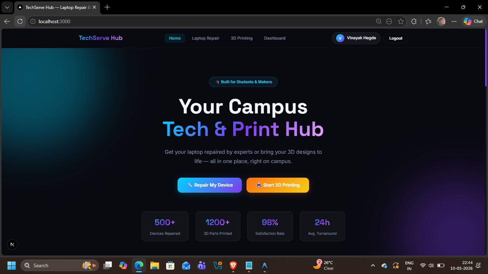
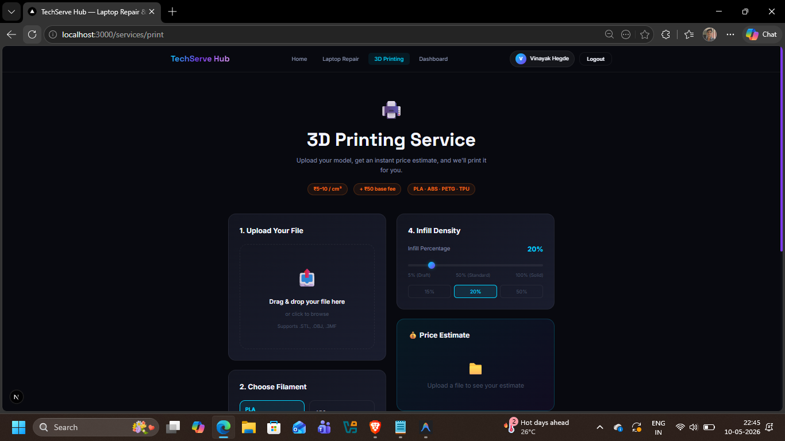
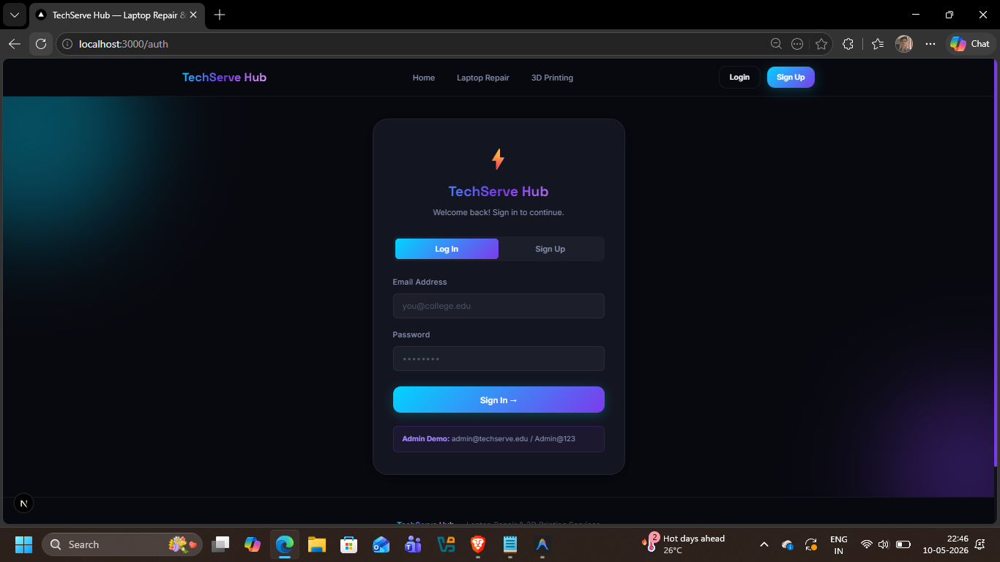
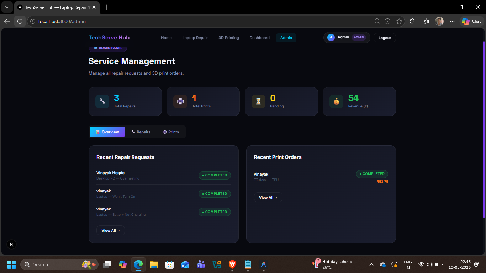
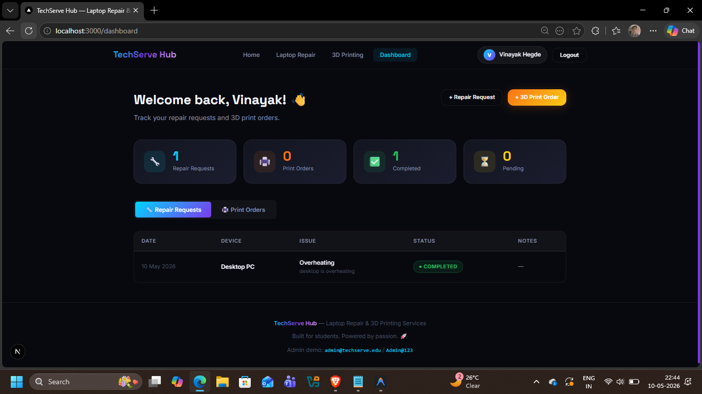

# 🛠️ TechServe Hub

A full-stack web application built with **Next.js 16** that provides two core campus services:
- 💻 **Laptop & System Repair** booking with admin management
- 🖨️ **3D Printing Service** with real-time STL file parsing and cost estimation

---
## 📸 Screenshots

### 🏠 Home Page


### 💻 Repair Service


### 🖨️ 3D Print Service



### 🖨️ Login page


### 🗂️ Admin Dashboard



### 📊 User Dashboard



## 📋 Table of Contents

- [Features](#-features)
- [Tech Stack](#-tech-stack)
- [Project Structure](#-project-structure)
- [Prerequisites](#-prerequisites)
- [Installation & Setup](#-installation--setup)
- [Environment Variables](#-environment-variables)
- [Gmail App Password Setup](#-gmail-app-password-setup)
- [Running the App](#-running-the-app)
- [Authentication](#-authentication)
- [Services Overview](#-services-overview)
- [Admin Panel](#-admin-panel)
- [Email Notifications](#-email-notifications)
- [Deployment](#-deployment)

---

## ✨ Features

- 🔐 Role-based authentication (User / Admin) — no external auth provider needed
- 💻 Repair request booking with category selection, urgency level, and issue description
- 🖨️ 3D print job submission with client-side STL volume parsing and instant cost estimation
- 📧 Automatic email confirmations sent to users and the admin on every submission
- 🗂️ Admin dashboard to view, filter, and manage all service requests
- 📦 localStorage-based data persistence (zero backend database required)
- 📱 Fully responsive design with a modern dark-themed UI

---

## 🧰 Tech Stack

| Layer | Technology |
|---|---|
| Framework | Next.js 16 (App Router) |
| Language | TypeScript |
| Styling | Vanilla CSS (globals.css) |
| Email | Nodemailer (Gmail SMTP) |
| STL Parsing | Custom client-side parser |
| Data Store | localStorage (browser) |
| Runtime | Node.js 18+ |

---

## 📁 Project Structure

```
techserve-hub/
├── src/
│   ├── app/
│   │   ├── page.tsx              # Home / Landing page
│   │   ├── layout.tsx            # Root layout with Navbar & Footer
│   │   ├── globals.css           # Global styles & design tokens
│   │   ├── auth/                 # Login & Register pages
│   │   ├── dashboard/            # User dashboard (my bookings)
│   │   ├── admin/                # Admin panel (all requests)
│   │   ├── services/
│   │   │   ├── repair/           # Repair service booking page
│   │   │   └── print/            # 3D print service booking page
│   │   └── api/
│   │       └── send-email/       # API route for Nodemailer email sending
│   ├── components/
│   │   ├── Navbar.tsx            # Top navigation bar
│   │   └── Footer.tsx            # Page footer
│   ├── context/                  # React context providers (Auth, etc.)
│   └── lib/
│       ├── types.ts              # Shared TypeScript interfaces
│       ├── store.ts              # localStorage CRUD helpers
│       ├── stl-parser.ts         # Binary/ASCII STL volume calculator
│       ├── mailer.ts             # Nodemailer transporter & send helpers
│       └── email.ts              # Email template builders
├── public/                       # Static assets
├── .env.local                    # 🔒 Local environment variables (not committed)
├── next.config.ts                # Next.js config
├── tsconfig.json                 # TypeScript config
├── eslint.config.mjs             # ESLint config
└── package.json                  # Dependencies & scripts
```

---

## ✅ Prerequisites

Make sure the following are installed on your machine before proceeding:

| Tool | Version | Download |
|---|---|---|
| Node.js | v18 or higher | https://nodejs.org |
| npm | v9 or higher (bundled with Node) | — |
| Git | Any recent version | https://git-scm.com |

Verify your installations:

```bash
node -v
npm -v
git -v
```

---

## 🚀 Installation & Setup

### 1. Clone the Repository

```bash
git clone https://github.com/Vinuhegde887/Tech-serve.git
cd Tech-serve
```

### 2. Install Dependencies

```bash
npm install
```

### 3. Configure Environment Variables

Create a `.env.local` file in the root of the project:

```bash
# Windows (PowerShell)
New-Item -Name ".env.local" -ItemType File

# macOS / Linux
touch .env.local
```

Then add the following contents (see the next section for values):

```env
# Gmail SMTP credentials
GMAIL_USER=your_gmail@gmail.com
GMAIL_APP_PASSWORD=your_16_char_app_password

# Admin notification recipient
ADMIN_EMAIL=your_admin_email@gmail.com
```

---

## 🔑 Environment Variables

| Variable | Description | Example |
|---|---|---|
| `GMAIL_USER` | Gmail address used to send emails | `abcd@gmail.com` |
| `GMAIL_APP_PASSWORD` | 16-character App Password from Google | `abcd efgh ijkl mnop` |
| `ADMIN_EMAIL` | Email address to receive admin alerts | `abcd@gmail.com` |

> ⚠️ **Never commit `.env.local` to version control.** It is already listed in `.gitignore`.

---

## 📧 Gmail App Password Setup

Gmail App Passwords are required because Google blocks plain password login for apps. Follow these steps:

### Step 1 — Enable 2-Step Verification
1. Go to [https://myaccount.google.com/security](https://myaccount.google.com/security)
2. Under **"How you sign in to Google"**, click **"2-Step Verification"**
3. Follow the prompts to enable it

### Step 2 — Generate an App Password
1. Go to [https://myaccount.google.com/apppasswords](https://myaccount.google.com/apppasswords)
2. In the **"App name"** field, type `TechServe Hub`
3. Click **"Create"**
4. Copy the generated **16-character password** (shown once)

### Step 3 — Add to `.env.local`
```env
GMAIL_APP_PASSWORD=abcd efgh ijkl mnop
```
> Spaces in the password are fine — Nodemailer handles them correctly.

---

## ▶️ Running the App

### Development Server

```bash
npm run dev
```

Open [http://localhost:3000](http://localhost:3000) in your browser. The page hot-reloads on file changes.

### Production Build

```bash
npm run build
npm run start
```

### Lint

```bash
npm run lint
```

---

## 🔐 Authentication

TechServe Hub uses a **custom, localStorage-based authentication system** — no third-party provider is needed.

### Demo Accounts

| Role | Email | Password |
|---|---|---|
| **Admin** | `admin@techserve.com` | `admin123` |
| **User** | Register a new account | Any password |

### How It Works

1. Users register via `/auth` — credentials are stored in `localStorage`
2. A session token is saved and checked on protected routes
3. The `AuthContext` (in `src/context/`) manages login state across the app
4. Admins are identified by a hardcoded role flag set at registration or login

---

## 🛠️ Services Overview

### 💻 Laptop & System Repair — `/services/repair`

- Select device type (Laptop / Desktop / Printer / Other)
- Choose urgency level (Low / Medium / High)
- Describe the issue
- Submit → confirmation email sent automatically

### 🖨️ 3D Printing — `/services/print`

- Upload an `.stl` file (binary or ASCII format supported)
- The browser instantly parses the file and calculates:
  - **Volume** (cm³)
  - **Material weight** (grams, assuming PLA density)
  - **Estimated cost** (₹ per gram)
- Select material and fill percentage
- Submit → confirmation email sent automatically

---

## 🗂️ Admin Panel — `/admin`

Accessible only to admin accounts.

| Feature | Description |
|---|---|
| View all requests | See repair and print jobs from all users |
| Filter by status | Pending / In Progress / Completed |
| Filter by type | Repair vs. Print |
| Update status | Change job status inline |
| Delete requests | Remove old or invalid entries |

---

## 📬 Email Notifications

Emails are sent via the **`/api/send-email`** Next.js API route using **Nodemailer** and Gmail SMTP.

### Triggered On:
- ✅ Successful repair request submission
- ✅ Successful 3D print request submission

### Recipients:
- **User** — receives a booking confirmation with their request details
- **Admin** (`ADMIN_EMAIL`) — receives an alert with full submission info

### Template Location:
- `src/lib/email.ts` — HTML email template builders
- `src/lib/mailer.ts` — Nodemailer transporter and `sendMail` wrappers

---

## 🌐 Deployment

### Deploy on Vercel (Recommended)

1. Push your code to GitHub
2. Go to [https://vercel.com/new](https://vercel.com/new)
3. Import your `Tech-serve` repository
4. Under **Environment Variables**, add:
   - `GMAIL_USER`
   - `GMAIL_APP_PASSWORD`
   - `ADMIN_EMAIL`
5. Click **Deploy** — your app will be live in minutes!

### Manual Deployment (Any Node Host)

```bash
npm run build
npm run start
```

Set the same environment variables in your host's dashboard or `.env` file.

---

## 📄 License

This project was built as a college engineering project (6th Semester — EI Department).  
Feel free to use it for educational purposes.

---

## 👨‍💻 Author

**Vinayak Hegde**  
GitHub: [@Vinuhegde887](https://github.com/Vinuhegde887)
